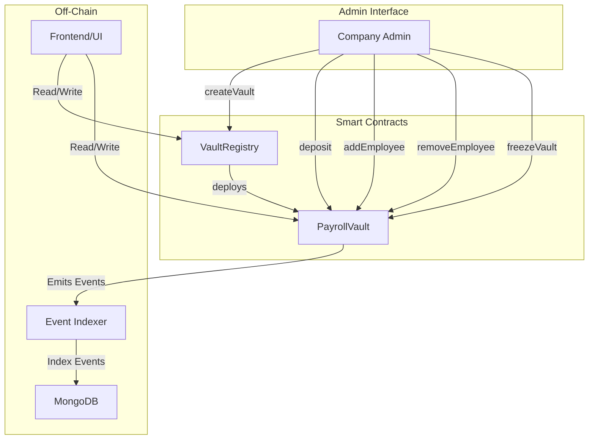

# Rootstock Payroll Vault - System Architecture

## Overview

This document describes the architecture for a Rootstock-based payroll vault system that enables companies to manage employee salary payments securely on-chain.

## System Architecture



## Contract Structure

### 1. VaultRegistry (Main Entry Point)

**Purpose:** Registry contract that manages company-to-vault mappings. Acts as a factory and directory for all payroll vaults.

**Location:** `packages/hardhat/contracts/VaultRegistry.sol`

**Key Features:**
- Company registration and vault creation
- Mapping of company address to vault contract address
- Registry of all deployed vaults
- Access control for admin functions

**State Variables:**
```solidity
mapping(address => address) public companyVaults;      // company -> vault address
address[] public vaultList;                            // list of all vault addresses
address public admin;                                  // contract admin
```

**Key Functions:**
- `createVault(string memory companyName)` - Deploy new payroll vault for company
- `getVaultAddress(address company)` - Get vault address for company
- `getAllVaults()` - Get list of all deployed vaults

### 2. PayrollVault (Core Vault Contract)

**Purpose:** Individual vault for each company managing employee salaries and withdrawals.

**Location:** `packages/hardhat/contracts/PayrollVault.sol`

**Key Features:**
- Employee management (add/remove with salary amount)
- Configurable payment schedule (withdrawal day of month)
- Time-based withdrawal locking
- Vault freezing capability
- Deposit functionality

**State Variables:**
```solidity
address public registry;           // reference to VaultRegistry
address public company;            // company/admin address
string public companyName;         // company identifier
bool public frozen;                // vault freeze status
uint8 public withdrawalDay;        // day of month for withdrawals (1-28)
uint256 public cycleStart;         // timestamp of current cycle start
mapping(address => Employee) public employees;
```

**Employee Structure:**
```solidity
struct Employee {
    uint256 salaryAmount;           // monthly salary in wei
    uint256 lastWithdrawTime;       // timestamp of last withdrawal
    bool isActive;                  // employment status
}
```

**Key Functions:**
- `deposit()` - Add funds to vault (payable)
- `addEmployee(address employee, uint256 salaryAmount)` - Register new employee
- `removeEmployee(address employee)` - Deactivate employee
- `withdraw()` - Employee withdraw salary
- `freezeVault(bool status)` - Enable/disable withdrawals
- `setWithdrawalDay(uint8 day)` - Configure withdrawal schedule
- `getEmployeeInfo(address employee)` - View employee details

## Access Control

### Roles

1. **Registry Admin** - Can manage vault registry (single admin)
2. **Company Admin** - Can manage their specific vault (owner of vault)
3. **Employee** - Can withdraw from vault (defined in employee mapping)

### Implementation

- Use OpenZeppelin's `Ownable` for ownership
- Custom modifiers for role-based access
- `whenNotFrozen` modifier for emergency controls

## Payment Logic

### Withdrawal Schedule

- Configurable withdrawal day (1-28) per vault
- Employees can only withdraw once per month
- Time-based validation using `block.timestamp`
- Withdrawal window: the configured day of each month

### Withdrawal Flow

1. Employee calls `withdraw()`
2. Contract verifies:
   - Vault is not frozen
   - Caller is registered employee
   - Current date is on or after withdrawal day
   - Has not withdrawn this month
3. If valid, transfer salary amount to employee
4. Update `lastWithdrawTime`
5. Emit `Withdrawal` event

## Events for Off-Chain Indexing

All events are designed for MongoDB indexing:

```solidity
// VaultRegistry Events
event VaultCreated(address indexed company, address vaultAddress, string companyName);

// PayrollVault Events
event Deposit(address indexed from, uint256 amount, uint256 newBalance);
event EmployeeAdded(address indexed employee, uint256 salaryAmount);
event EmployeeRemoved(address indexed employee);
event Withdrawal(address indexed employee, uint256 amount, uint256 timestamp);
event VaultFrozen(bool status);
event WithdrawalDayChanged(uint8 oldDay, uint8 newDay);
event CompanyUpdated(string newName);
```

## Security Considerations

1. **Reentrancy Protection** - Use `nonReentrant` modifier on withdrawals
2. **Access Control** - Only company admin can manage employees
3. **Pausable** - Freeze capability for emergency situations
4. **Validation** - Check employee exists and is active before withdrawal
5. **Time-based** - Validate withdrawal timing to prevent early withdrawals

## Deployment

### Networks
- Rootstock Testnet (chainId: 31)
- Rootstock Mainnet (chainId: 30)

### Deployment Order
1. Deploy `VaultRegistry` first
2. Use registry to create company vaults
3. Each vault deployed via factory pattern

## Extensibility

The vault can be modified for:
- **Prize Distribution** - Random or scheduled token distribution
- **Token Vesting** - Time-based token release schedules
- **Grant Management** - Research/developer grants
- **Bonuses** - Performance-based payments

## Technical Stack

- **Smart Contracts:** Solidity 0.8.20
- **Framework:** Hardhat
- **Libraries:** OpenZeppelin Contracts
- **Testing:** Hardhat w/ ethers.js
- **Indexing:** Events → External Indexer → MongoDB

## Contract API Summary

### VaultRegistry
| Function | Description | Access |
|----------|-------------|--------|
| createVault | Deploy new company vault | Public |
| getVaultAddress | Query vault for company | Public |
| getAllVaults | List all vaults | Public |

### PayrollVault
| Function | Description | Access |
|----------|-------------|--------|
| deposit | Fund the vault | Public |
| addEmployee | Register employee | Company Admin |
| removeEmployee | Deactivate employee | Company Admin |
| withdraw | Claim salary | Employee |
| freezeVault | Toggle freeze status | Company Admin |
| setWithdrawalDay | Configure schedule | Company Admin |
| getEmployeeInfo | View employee data | Public |